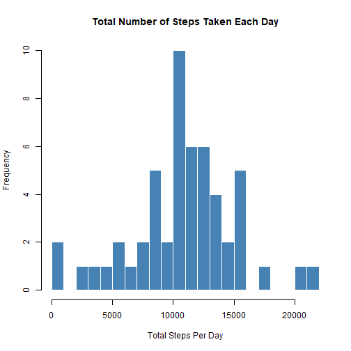
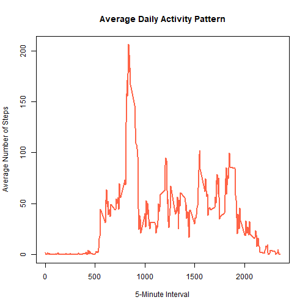
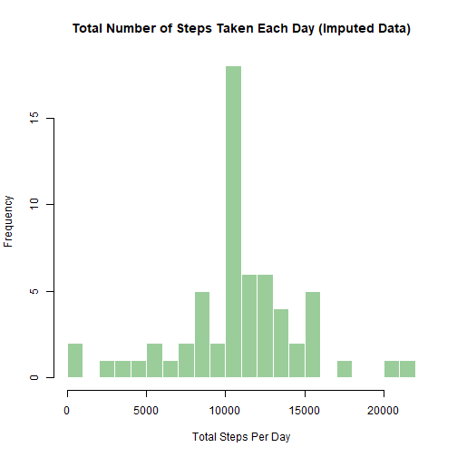
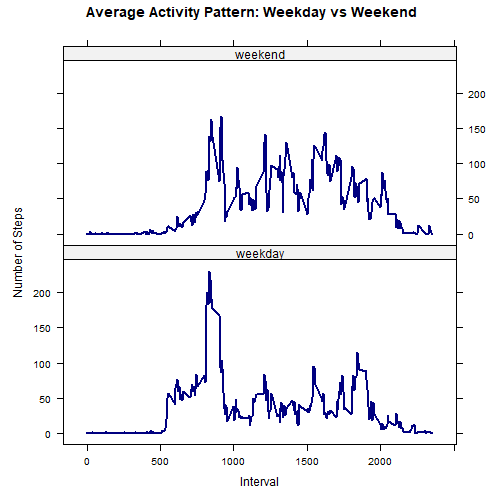

``` r
# Show all code in the final report for peer-review transparency
knitr::opts_chunk$set(echo = TRUE)
# Prefer standard decimal formatting instead of scientific notation
options(scipen = 999)
```

## Loading and preprocessing the data


``` r
# Course dataset URL
data_url <- "https://d396qusza40orc.cloudfront.net/repdata%2Fdata%2Factivity.zip"

# Download zip only when it is not already present locally
if (!file.exists("activity.zip")) {
  download.file(data_url, destfile = "activity.zip", mode = "wb")
}

# Extract CSV only when needed
if (!file.exists("activity.csv")) {
  unzip("activity.zip")
}

# Read activity data and parse dates for time-based summaries
activity <- read.csv("activity.csv", stringsAsFactors = FALSE)
activity$date <- as.Date(activity$date)

dim(activity)
```

```
## [1] 17568     3
```

``` r
head(activity)
```

```
##   steps       date interval
## 1    NA 2012-10-01        0
## 2    NA 2012-10-01        5
## 3    NA 2012-10-01       10
## 4    NA 2012-10-01       15
## 5    NA 2012-10-01       20
## 6    NA 2012-10-01       25
```

``` r
summary(activity)
```

```
##      steps             date               interval     
##  Min.   :  0.00   Min.   :2012-10-01   Min.   :   0.0  
##  1st Qu.:  0.00   1st Qu.:2012-10-16   1st Qu.: 588.8  
##  Median :  0.00   Median :2012-10-31   Median :1177.5  
##  Mean   : 37.38   Mean   :2012-10-31   Mean   :1177.5  
##  3rd Qu.: 12.00   3rd Qu.:2012-11-15   3rd Qu.:1766.2  
##  Max.   :806.00   Max.   :2012-11-30   Max.   :2355.0  
##  NA's   :2304
```


## What is mean total number of steps taken per day?


``` r
# Ignore missing values for this section
activity_no_na <- activity[!is.na(activity$steps), ]

# Sum steps across intervals to get total steps per day
daily_totals <- aggregate(steps ~ date, data = activity_no_na, sum)

# Distribution of total daily steps
hist(
  daily_totals$steps,
  breaks = 20,
  col = "steelblue",
  border = "white",
  main = "Total Number of Steps Taken Each Day",
  xlab = "Total Steps Per Day"
)
```



``` r
mean_total_steps <- mean(daily_totals$steps)
median_total_steps <- median(daily_totals$steps)

mean_total_steps
```

```
## [1] 10766.19
```

``` r
median_total_steps
```

```
## [1] 10765
```

The mean total number of steps per day is 10766.19 and the median is 10765.


## What is the average daily activity pattern?


``` r
# Compute mean steps for each 5-minute interval across all days
interval_means <- aggregate(steps ~ interval, data = activity_no_na, mean)

# Time-series style line plot of average interval activity
plot(
  interval_means$interval,
  interval_means$steps,
  type = "l",
  lwd = 2,
  col = "tomato",
  main = "Average Daily Activity Pattern",
  xlab = "5-Minute Interval",
  ylab = "Average Number of Steps"
)
```



``` r
max_interval <- interval_means$interval[which.max(interval_means$steps)]
max_interval_steps <- max(interval_means$steps)

max_interval
```

```
## [1] 835
```

``` r
max_interval_steps
```

```
## [1] 206.1698
```

The 5-minute interval with the highest average activity is 835, with an average of 206.17 steps.


## Imputing missing values

Imputation strategy: replace each missing `steps` value with the mean number of steps for that same 5-minute `interval`, calculated from the non-missing data.


``` r
# Count rows where steps is missing
total_missing <- sum(is.na(activity$steps))
total_missing
```

```
## [1] 2304
```

``` r
# Use interval mean to fill missing values
activity_imputed <- activity
missing_idx <- is.na(activity_imputed$steps)

# Replace each missing value using the matching interval mean
activity_imputed$steps[missing_idx] <- interval_means$steps[
  match(activity_imputed$interval[missing_idx], interval_means$interval)
]

sum(is.na(activity_imputed$steps))
```

```
## [1] 0
```

There are 2304 missing values in the original dataset.


``` r
# Recompute daily totals after imputation
daily_totals_imputed <- aggregate(steps ~ date, data = activity_imputed, sum)

# Distribution of total daily steps after filling missing values
hist(
  daily_totals_imputed$steps,
  breaks = 20,
  col = "darkseagreen3",
  border = "white",
  main = "Total Number of Steps Taken Each Day (Imputed Data)",
  xlab = "Total Steps Per Day"
)
```



``` r
mean_total_steps_imputed <- mean(daily_totals_imputed$steps)
median_total_steps_imputed <- median(daily_totals_imputed$steps)

mean_total_steps_imputed
```

```
## [1] 10766.19
```

``` r
median_total_steps_imputed
```

```
## [1] 10766.19
```

``` r
data.frame(
  dataset = c("Original (NA removed)", "Imputed"),
  mean_steps = c(mean_total_steps, mean_total_steps_imputed),
  median_steps = c(median_total_steps, median_total_steps_imputed)
)
```

```
##                 dataset mean_steps median_steps
## 1 Original (NA removed)   10766.19     10765.00
## 2               Imputed   10766.19     10766.19
```

After imputation, the mean is 10766.19 and the median is 10766.19. Compared with the original NA-removed dataset, the mean changes by 0 and the median changes by 1.19.


## Are there differences in activity patterns between weekdays and weekends?


``` r
# Label each date as weekday or weekend
activity_imputed$day_type <- ifelse(
  weekdays(activity_imputed$date) %in% c("Saturday", "Sunday"),
  "weekend",
  "weekday"
)

# Store as ordered factor for consistent panel ordering
activity_imputed$day_type <- factor(
  activity_imputed$day_type,
  levels = c("weekday", "weekend")
)

# Average steps by interval and day type
interval_daytype_means <- aggregate(
  steps ~ interval + day_type,
  data = activity_imputed,
  mean
)

library(lattice)

# Two-panel comparison: weekday vs weekend interval patterns
xyplot(
  steps ~ interval | day_type,
  data = interval_daytype_means,
  type = "l",
  layout = c(1, 2),
  lwd = 2,
  col = "navy",
  xlab = "Interval",
  ylab = "Number of Steps",
  main = "Average Activity Pattern: Weekday vs Weekend"
)
```




``` r
# Overall average steps per interval by day type
overall_by_daytype <- aggregate(steps ~ day_type, data = activity_imputed, mean)
overall_by_daytype
```

```
##   day_type    steps
## 1  weekday 35.61058
## 2  weekend 42.36640
```

The activity pattern differs between weekdays and weekends, and the average number of steps per interval is 35.61 on weekdays versus 42.37 on weekends.
